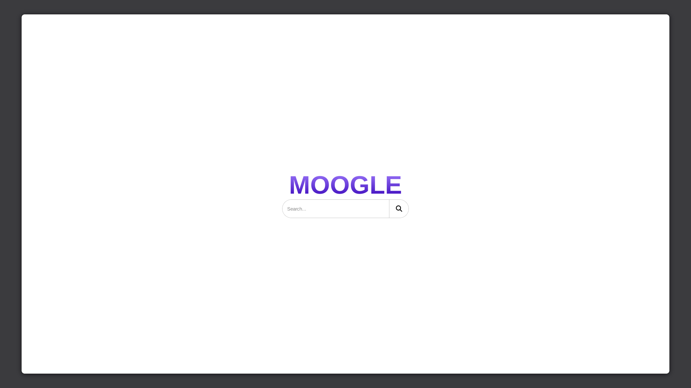
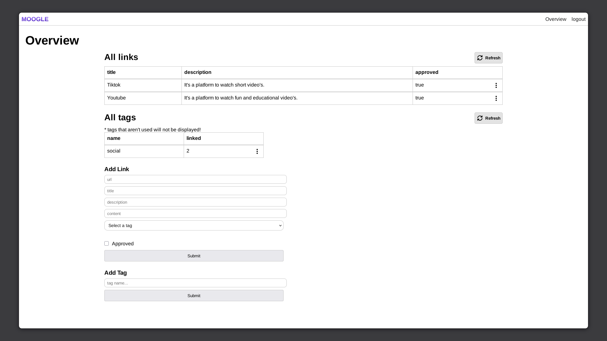

# MOOGLE SEARCH ENGINE

## Overview

Moogle Search Engine is a moderated search platform built with Vue.js and Spring Boot.

The platform allows users to search categorized links through a simple search interface while providing administrators and moderators with tools to manage indexed content.

The project includes:

* Tag-based search
* Authentication system
* Role-based permissions
* Link moderation dashboard
* Tag management system

---

## Frontend

### Main Interface

* Logo displayed above the search bar
* Search bar centered on the homepage
* Simple and lightweight user interface
  

### Dashboard

Administrators and moderators have access to a moderation dashboard where they can:

* Add links
* Edit links
* Remove links
* Manage tags

---

## Roles & Permissions

### Admin

* Full access
* Can create new tags
* Can manage links and moderators

### Moderator

* Can add, edit, and remove links
* Can use existing tags when creating links


---

## Link Structure

Each indexed link contains:

* URL
* Title
* Description
* Optional content
* Tags
* Approval status

Example fields:

* `title`
* `description`
* `content`
* `approved`
* `tags`


---

## API Endpoints

### Search

#### GET `/api/search?q=example`

Search indexed links using tags.

Example request:

```http
GET /api/search?q=social
```

---

### Authentication

#### POST `/api/auth/login`

Authentication endpoint for moderators and administrators.

---

### Moderation

#### POST `/api/mod/add-url`

Add a new link to the search index.

Example request body:

```json
{
  "url": "https://example.com",
  "title": "Example Title",
  "description": "Example Description",
  "content": "Example Content",
  "tags": ["Social", "Forum"]
}
```

---

#### POST `/api/mod/add-tag`

Create a new tag.

Example request body:

```json
{
  "name": "tag"
}
```

---

## Authentication & Security

The project includes:

* JWT Authentication
* Password Hashing
* Role-based Authorization
* Permission Management

---

## Moderation Features

* CRUD Links
* CRUD Tags
* Approval System
* Role-based Access Control

---

## Tech Stack

### Frontend

* Vue.js

### Backend

* Spring Boot
* Java

### Authentication

* JWT

---

## Future Plans

* Full-text search
* Better ranking system
* Search analytics
* Improved UI/UX
* Advanced filtering
* Web crawler support

---

## Status

Work in progress.
